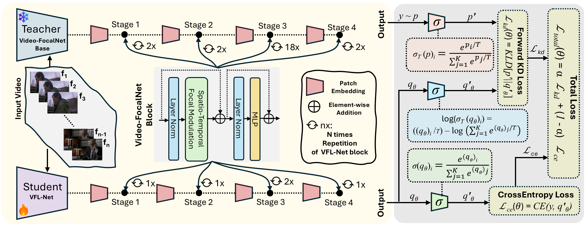
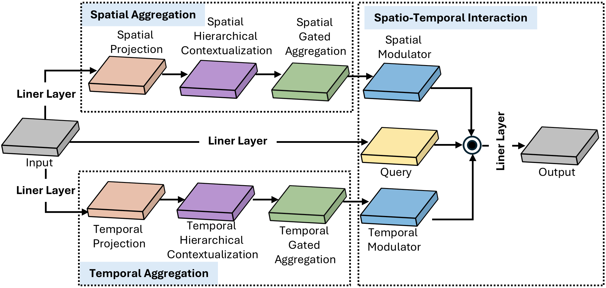

# DVFL-Net: A Lightweight Distilled Video Focal Modulation Network for Spatio-Temporal Action Recognition

[Hayat Ullah](https://scholar.google.com.pk/citations?user=xnXPj0UAAAAJ&hl=en),
[Muhammad Ali Shafique](https://scholar.google.com.pk/citations?user=TppbarkAAAAJ&hl=en&oi=ao),
[Abbas Khan](https://scholar.google.com.pk/citations?user=k-HJxNAAAAAJ&hl=en),
[Arslan Munir](https://scholar.google.com.pk/citations?user=-P9waaQAAAAJ&hl=en)

<!-- [](https://arxiv.org/abs/2307.06947) -->

<hr />

> **Abstract:**
>*The landscape of video recognition has undergone a significant transformation, shifting from traditional Convolutional Neural Networks (CNNs) to Transformer-based architectures in order to achieve better accuracy. While CNNs, especially 3D variants, have excelled in capturing spatio-temporal dynamics for action recognition, recent developments in Transformer models, with their self-attention mechanisms, have proven highly effective in modeling long-range dependencies across space and time. Despite their state-of-the-art performance on prominent video recognition benchmarks, the computational
demands of Transformers, particularly in processing dense video data, remain a significant hurdle. To address these challenges, we introduce a lightweight Video Focal Modulation Network named DVFL-Net, which distills the spatio-temporal knowledge from large pre-trained teacher to nano student model, making it well-suited for on-device applications. By leveraging knowledge distillation and spatial-temporal feature extraction, our model significantly reduces computational overhead (approximately 7×) while maintaining high performance in video recognition tasks. We combine the forward Kullback–Leibler (KL) divergence and spatio-temporal focal modulation to distill the local and global spatio-temporal context from the Video-FocalNet Base (teacher) to our proposed nano VFL-Net (student) model. We extensively evaluate our DVFL-Net, both with and without forward KL divergence, against recent state-of-the-art HAR approaches on UCF50, UCF101, and HMDB51 datasets. Further, we conducted a detailed ablation study in forward KL divergence settings and reports the obtained observations. The obtained results confirm the superiority of the distilled VFL-Net (i.e., DVFL-Net) over existing methods, highlighting its optimal tradeoff between performance and computational efficiency, including reduced memory usage and lower GFLOPs, making it a highly efficient solution for HAR tasks.*




## Training (Teacher Pretraining)
To train teacher model on a given dataset, run the following:
```bash
torchrun --nproc_per_node <num-of-gpus-to-use>  main.py --cfg <config-file> --output <output-directory> --opts DATA.NUM_Frames <number of frames> 
```
- ``` --nproc_per_node ```: set the number of GPU devices, in our case we used 3 GPUs.
- ``` --cfg ```: the path of config file (located in configs directory), containing the model, data, and training configurations.
- ``` --output ```: the path of output directory that will contain the training history (incluing both model weights and training logs).
- ``` --opts ```: it allow user to provide additional data related (number of frames) or training related (i.e., hyper-parameter).
  
For instance, to train the teacher model (pretraining) using 3 GPUs on the UCF101 dataset, run the following command:
```bash
torchrun --nproc_per_node 3 main.py --cfg configs/ucf101/video-focalnet_base.yaml --output output/ --opts DATA.NUM_FRAMES 8
```
**Note:** During pretraining, we intialized our teacher model with the ImageNet-1K weights of [FocalNets](https://github.com/microsoft/FocalNet) model. To initialize a model with pretrained weights, set ```TRAIN.PRETRAINED_PATH``` to the path of the pretrained model weights. This can be configured either in the configuration file (located in the ```configs``` directory) or directly in the bash script. Alternatively, to train the model from scratch, simply leave ```TRAIN.PRETRAINED_PATH``` empty.

Alternatively, the above step can be done by simply running ``` bash.sh ``` file located in scripts directory. For instance:
```bash
bash scripts/ucf101/video-focalnet_base.sh
```

<!-- Additionally, the TRAIN.PRETRAINED_PATH can be set (either in the config file or bash script) to provide a pretrained model to initialize the weights. To initialize from the ImageNet-1K weights please refer to the FocalNets repository and download the FocalNet-T-SRF, FocalNet-S-SRF or FocalNet-B-SRF to initialize Video-FocalNet-T, Video-FocalNet-S or Video-FocalNet-B respectively. Alternatively, one of the provided pretrained Video-FocalNet models can also be utilized to initialize the weights. -->

## Training (Knowledge Distillation)
To train student model in knowledge distillation settings (under the supervision of pretrained teacher mode) on a given dataset, run the following:

<!--
## Citation
If you find our work, this repository, or pretrained models useful, please consider giving a star :star: and citation.
```bibtex
@InProceedings{Wasim_2023_ICCV,
    author    = {Wasim, Syed Talal and Khattak, Muhammad Uzair and Naseer, Muzammal and Khan, Salman and Shah, Mubarak and Khan, Fahad Shahbaz},
    title     = {Video-FocalNets: Spatio-Temporal Focal Modulation for Video Action Recognition},
    booktitle = {Proceedings of the IEEE/CVF International Conference on Computer Vision (ICCV)},
    year      = {2023},
}
``` 
-->

## Contact
For any questions or inquiries, please open an issue in this repository or contact us at hullah2024@fau.edu. 

## Acknowledgements
We acknowledge that our work is inspired by the [FocalNets](https://github.com/microsoft/FocalNet) and [Video-FocalNets](https://github.com/TalalWasim/Video-FocalNets) repositories. We sincerely thank the authors for making their code publicly available.
<!-- If you use our model, please consider citing these works as well. -->
